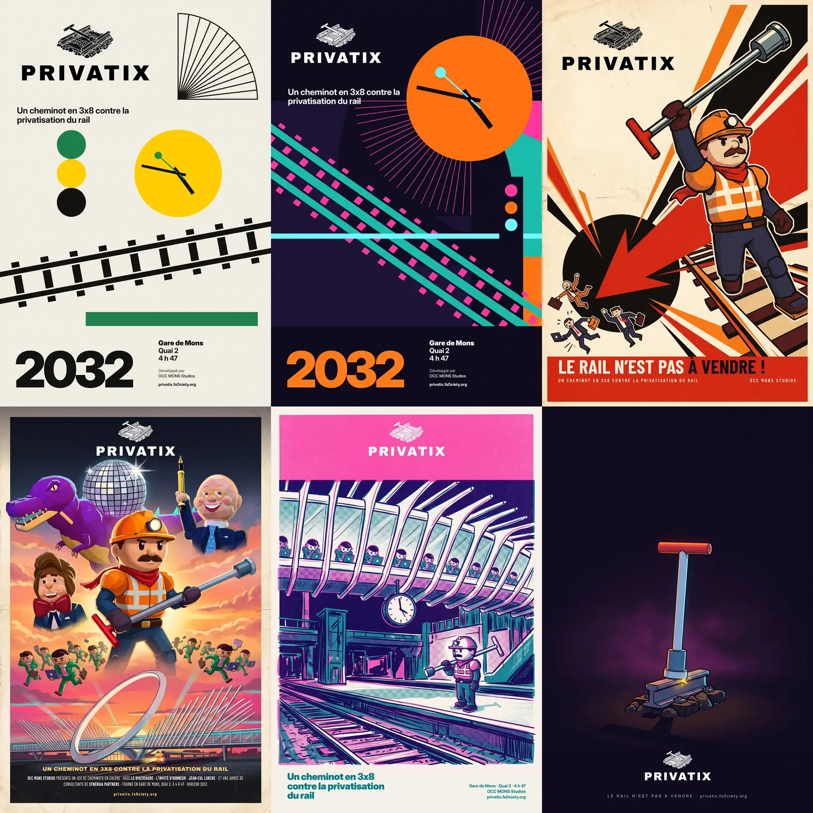

# Affiches avec le logo mono

Série d'affiches construite sur le **nouveau logo officiel mono** du porteur du projet (`../officiel/logo/privatix-logo-mono-blanc.svg` et `-noir.svg` : l'emblème clé à tire-fond sur un tronçon de rail, au-dessus du mot PRIVATIX). Elle comprend deux affiches en **style typographique international (« suisse »)** et quatre **directions libres**. **À valider par le porteur du projet.**



## Méthode

1. **Logo rasterisé** en PNG transparent de 2048 px (`refs/privatix-logo-mono-{blanc,noir}-2048.png`, rendu Chromium des SVG). Ces PNG sont passés au générateur comme image de référence, pour qu'il équilibre la composition autour du logo.
2. **Fonds sans texte ni logo** générés par Nano Banana (`gemini-nano-banana-2.1`, 2:3, 2K), chaque prompt réservant une zone vide pour le logo et une autre pour le texte. Le modèle n'a **jamais** dessiné le logo : c'est la seule façon de garantir la forme exacte de l'emblème et du mot.
3. **Composition** (`tools/marketing/compose/`, gabarits HTML rendus par Chromium) : le **vrai SVG** du logo est incrusté tel quel (vectoriel, net à toute taille) et la typographie est composée avec de vraies polices.
4. **Correction vectorielle** des deux affiches suisses : le générateur dessine des aiguilles d'horloge fantaisistes (une aiguille coudée sur le fond jaune). Le gabarit redessine donc par-dessus le disque généré, à la même place et dans la même couleur, une horloge de quai juste à **4 h 47**, avec des aiguilles pleines et une trotteuse à palette, clin d'œil aux horloges de gare suisses.

Commandes :

```sh
GEMINI_API_KEY=… node tools/marketing/nanobanana.mjs docs/marketing/affiches-logo-mono/jobs.json
node tools/marketing/compose/render.mjs docs/marketing/affiches-logo-mono/compose.json
```

### Typographie

- **Affiches suisses et riso : Inter Display** (OFL, `tools/marketing/compose/fonts/InterDisplay-*.otf`, licence `OFL-Inter.txt`). C'est une néo-grotesque de la lignée Helvetica : capitales à terminaisons horizontales, « a » et « t » de facture suisse, chasses régulières. Sa coupe *Display*, dessinée pour les grands corps, a un crénage plus serré et des contreformes plus fermées que l'Inter de texte. Elle tient donc le « 2032 » géant en Black et les colonnes d'information en Bold et Medium sans changer de famille, comme l'exige le style suisse. Archivo, plus large et plus géométrique, s'éloigne davantage de l'Helvetica ; Inter Tight n'existe qu'en texte. La police était déjà installée dans l'environnement : elle est copiée dans le dépôt avec sa licence.
- **Constructiviste** : Barlow Condensed Bold (capitales condensées, registre des affiches syndicales).
- **Film des années 70** : Archivo Black pour l'accroche, Barlow Condensed étirée verticalement pour le bloc de générique (« billing block »).
- **Minimaliste** : Inter Display Medium en capitales très espacées, l'URL restant en bas de casse pour que le zéro de « fs0ciety » ne se lise pas comme un O.

## Fichiers

Les `affiche-*.jpg` sont les affiches livrées (2048 × 3072, JPEG qualité 92). Les `fond-*.jpg` sont les fonds sans texte, tels que livrés par l'API (JPEG 1696 × 2528). Les `*-1600.webp` sont les aperçus. Les fonds portent le filigrane invisible SynthID. Prompts complets (anglais) : [`jobs.json`](jobs.json) et [`../PROMPTS.md`](../PROMPTS.md#affiches-avec-le-logo-mono) ; composition : [`compose.json`](compose.json) ; usage de l'API : [`log.json`](log.json).

| Affiche livrée | Direction | Prompt du fond (résumé) | Références passées | Logo | Coût estimé |
|---|---|---|---|---|---|
| [`affiche-suisse-jaune.jpg`](affiche-suisse-jaune-1600.webp) | Style suisse, palette de l'inspiration (jaune, noir, vert sur papier) | Grille stricte, formes plates : deux rails en diagonale, horloge jaune, signal à trois feux, bordure de quai verte, éventail de côtes ; haut gauche et bas réservés | logo mono noir | noir | ≈ 0,18 $ |
| [`affiche-suisse-jeu.jpg`](affiche-suisse-jeu-1600.webp) | Style suisse, palette du jeu (magenta, turquoise, orange, cyan sur nuit) | Mêmes formes, horloge orange géante, rails turquoise à traverses magenta, éventail magenta | logo mono blanc, planche palette DA | blanc | ≈ 0,15 $ |
| [`affiche-constructiviste.jpg`](affiche-constructiviste-1600.webp) | Propagande syndicale constructiviste (Lissitzky, Rodtchenko) | Héros en contre-plongée brandissant la clé, coin rouge enfonçant un cercle noir, consultants éparpillés ; papier crème, rouge, noir | héros, consultant, clé à tire-fond, logo mono noir | noir | ≈ 0,14 $ |
| [`affiche-film-70s.jpg`](affiche-film-70s-1600.webp) | Affiche de film d'aventure des années 70, peinte à l'aérographe | Montage : héros géant, Discosaure sous la boule à facettes, caricatures toon de Di Rupo et Lurcke en vignettes, ruée de consultants, gare de Mons au couchant | héros, Discosaure, Di Rupo, Lurcke, consultant, clé, logo mono blanc | blanc | ≈ 0,14 $ |
| [`affiche-riso.jpg`](affiche-riso-1600.webp) | Risographie bichrome (rose fluo + sarcelle) | Quai 2 de nuit sous les côtes de la passerelle, horloge à 4 h 47, héros seul sur le quai, consultants rivés à leurs portables sur la passerelle ; aplat rose réservé en haut | héros, consultant, clé, logo mono blanc | blanc, réservé dans l'aplat rose | ≈ 0,14 $ |
| [`affiche-minimal-cle.jpg`](affiche-minimal-cle-1600.webp) | Minimaliste, une seule image forte | La clé à tire-fond plantée dans un rail comme l'épée dans le rocher, une étincelle, nuit violette, immense vide | clé, planche palette DA, logo mono blanc | blanc | ≈ 0,13 $ |

**Total estimé : ≈ 0,87 $** pour 6 images, sans refus ni relance. Le calcul suit le tarif public de Nano Banana 2 (sorties à ≈ 60 $ par million de jetons, ≈ 14 300 jetons de sortie en tout, texte interne du modèle compris ; entrées négligeables, ≈ 26 000 jetons) et les compteurs de `log.json`. Le montant réel est sur la console de facturation Google. Les compositions ne coûtent rien.

## Avis de la direction artistique

| Affiche | Forces | Défauts | Verdict |
|---|---|---|---|
| Suisse jaune | La plus fidèle à l'inspiration : grille lisible, beaucoup d'air, le logo mono noir y est chez lui (gravure noire sur papier). Le « 2032 » en Inter Display Black donne l'ancrage typographique, et l'horloge corrigée lit vraiment 4 h 47. | Les traverses du rail débordent irrégulièrement des deux files : c'est « abstrait », mais un œil suisse le verrait. L'éventail en haut à droite est un peu sec. | **Recommandée** : la plus élégante, parfaite en print et en vitrine. |
| Suisse jeu | Ça claque : l'horloge orange géante et les rails turquoise sont immédiatement « Privatix », et le logo blanc tient bien sur la nuit. | Plus chargée, et le modèle a ajouté des aplats violets fantômes en fond. Il a fallu réduire le logo à 5 colonnes pour qu'il ne touche pas l'horloge. | Bonne déclinaison réseaux et écrans, moins pure que la jaune. |
| Constructiviste | La plus forte en impact : héros fidèle, coin rouge de Lissitzky détourné contre les consultants, mot d'ordre lisible de loin. | La clé est tenue à l'envers (douille en haut), cohérent avec le geste du drapeau mais moins « outil ». | **Recommandée** pour le militantisme : manifs, stands, réseaux. |
| Film des années 70 | La plus généreuse : tout le casting dans une seule image, caricatures toon bon enfant et respectueuses, ton de grand film d'aventure. | La gare est stylisée : l'anneau de Calatrava est posé au sol au lieu d'être en surplomb, et le bas de l'image est dense, donc le générique chevauche la gare. | Très bonne affiche « événement » (sortie, festival) ; gare à reprendre si elle doit être fidèle. |
| Risographie | La plus « objet » : grain, surimpression violette et repérage décalé crédibles, le quai 2 et l'horloge racontent le 3x8. Le logo blanc réservé dans le rose a l'air imprimé. | Le texte en sarcelle est posé en multiplication, sans le grain du tirage. Un vrai riso aurait des marges blanches plus régulières. | Excellente pour les fanzines, le merch et les sérigraphies ; à imprimer en vrai riso. |
| Minimaliste clé | La plus iconique : un objet, une étincelle, du vide. Elle fonctionne aussi en avatar, en couverture d'OST ou en teaser. | Peu d'information : elle suppose que l'on connaisse déjà le jeu. | **Recommandée** comme teaser et visuel d'annonce. |

Mon trio de tête : **suisse jaune** (identité), **constructiviste** (combat) et **minimaliste clé** (teaser). Aucune n'est officielle tant que le porteur du projet ne les a pas validées.
