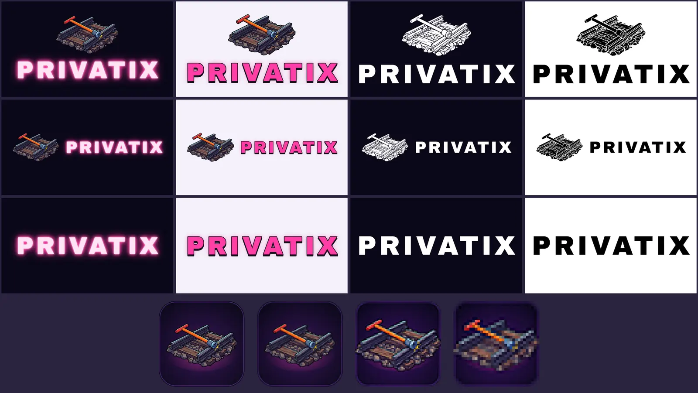

# Visuels officiels de Privatix

Choix du porteur du projet sur le [lot 2](../lot2/README.md) : **logo A1** (wordmark néon + emblème clé à tire-fond sur un tronçon de rail), **affiche « Marquise »** et **bannière composée**. Ce dossier les décline fidèlement pour tous les usages. Rien n'a été réinventé : le key art de l'affiche et celui de la bannière sont ceux du lot 2. Seuls deux appels au générateur ont servi, à des fins techniques : un redessin 2K de l'emblème et une extension latérale de la bannière (voir [Génération](#génération-et-coût)).



## Inventaire

### Logo (`logo/`)

Pour chaque mise en page, quatre versions : **`-sombre`** (néon du site, sur fond sombre), **`-clair`** (tube magenta cerné d'encre, sur fond clair), **`-mono-blanc`** et **`-mono-noir`** (aplats, sans lueur). Chaque version existe en **SVG** et en **PNG transparent de 2048 px** sur le grand côté.

| Fichier | Mise en page | Usage type |
|---|---|---|
| `privatix-lockup-vertical-*.svg/.png` | Emblème centré au-dessus du wordmark (≈ 2:1), sans le vide du bas de A1 | Logo principal : écran titre, affiches, press kit, réseaux |
| `privatix-lockup-horizontal-*.svg/.png` | Emblème à gauche, wordmark à droite, cadre 3:1 | En-têtes, bandeaux, signatures, pied de page |
| `privatix-wordmark-*.svg/.png` | Wordmark seul | Quand l'emblème est déjà présent ou que la place manque, titres de compositions |
| `embleme.png` | Emblème couleur détouré, 2048 × 1256, transparent | Source de l'emblème (icônes, lockups) |
| `embleme-mono-blanc.svg/.png`, `embleme-mono-noir.svg/.png` | Emblème vectorisé en aplat, traits encrés en jours | Gravure, tampon, marquage une couleur |
| `icone/privatix-icone-{1024,512,256,128,64,32,16}.png` | Emblème seul sur fond nuit arrondi | Appli, Steam, avatars ; 64 px et moins : emblème plein cadre et accentué |
| `icone/privatix-icone.svg` | Icône maîtresse (vectorielle, emblème embarqué) | Source des PNG |
| `icone/favicon.svg`, `icone/favicon.ico` (16, 32, 48) | Favicon | Site, jeu |
| `icone/apple-touch-icon-180.png` | Plein cadre, opaque (iOS arrondit lui-même) | `apple-touch-icon` |
| `icone/privatix-icone-masquable-512.png` | Plein cadre, emblème dans la zone sûre de 80 % | Manifeste web (`purpose: maskable`) |
| `icone/privatix-icone-macos-1024.png`, `icone/privatix.icns`, `icone/privatix.ico` | Grille macOS (824 px sur 1024, coins de 185 px) ; ICO 16 → 256 | Appli Electron |

Le **wordmark est du vrai vectoriel** : les contours d'**Archivo Black** (OFL), l'équivalent libre le plus proche de l'Arial Black du logotype du site (`docs/DESIGN_SYSTEM.md` § 2.4), mis en forme avec le crénage de la police et une approche de 0,1 em, comme `.hero__title`. Le néon reprend la recette de `.neon` (`site/src/styles/site.css`) traduite en filtre SVG : tube `#FFE3F3`, halos magenta `#FF3EA5`, ombre dure encrée `#14101A`. Le texte est converti en tracés : aucune police n'est requise pour ouvrir les SVG. Les SVG des lockups couleur embarquent l'emblème en PNG (1024 px), c'est pourquoi ils pèsent ≈ 1 Mo ; les versions mono sont entièrement vectorielles (≈ 45 Ko).

### Affiche « Marquise » (`affiche/`)

| Fichier | Format | Usage |
|---|---|---|
| `privatix-affiche-marquise-4k.jpg` | 2560 × 3840 (2:3), JPEG qualité 92 | Affiche officielle (web, réseaux, impression jusqu'au A3) |
| `privatix-affiche-marquise-a3-fonds-perdus.pdf` | 303 × 426 mm (A3 + 3 mm de fonds perdus) | Impression A3 |
| `privatix-affiche-marquise-a2-fonds-perdus.pdf` | 426 × 600 mm (A2 + 3 mm de fonds perdus) | Impression A2 |
| `keyart-affiche-marquise-4k.jpg` | 2560 × 3840, sans texte | Presse, fonds, recadrages libres |

Le key art 2K du lot 2 est agrandi au **Lanczos** (× 1,51, léger renforcement) : sur un rendu toon à aplats, l'agrandissement reste propre et une régénération 4K n'aurait pas été identique. Le titre et les crédits sont recomposés **à la taille finale** (texte net, vectoriel dans les PDF). Les PDF sont au format A, moins haut que le 2:3 : le key art y est recalé et le bloc titre légèrement compacté pour garder le Discosaure dégagé et le héros entier. Dans les PDF, le texte reste vectoriel, les lueurs sont pixellisées à 300 ppp et le key art est à ≈ 150 ppp en A2, ce qui suffit pour une affiche vue à distance. Après coupe, le titre reste à ≈ 6 mm du bord haut en A3 (≈ 10 mm en A2) et les crédits à 15 mm des bords latéraux. Les PDF sont en RVB : l'imprimeur fait la conversion CMJN.

### Bannières (`bannieres/`)

Tous les formats partent du **key art de la bannière officielle**, recadré avec le même rognage de 7,5 % que la bannière composée (le cadre translucide parasite disparaît). Le titre, l'accroche et les crédits sont recomposés pour chaque format par `tools/marketing/compose/templates/banniere-format.html`. Les fichiers `*-1600.webp` sont des aperçus.

| Fichier | Taille | Contenu | Zones de sécurité |
|---|---|---|---|
| `site-hero-1920x1080.jpg`, `site-hero-2560x1440.jpg` | 16:9 | Bannière officielle à l'identique (titre, accroche, crédits) | Marges de 6 % |
| `open-graph-1200x630.jpg` | 1,91:1 | Titre + accroche | Texte dans le tiers droit, à plus de 6 % des bords |
| `steam-header-920x430.jpg` | Capsule d'en-tête | Titre seul (règle Steam : pas d'accroche ni de mentions) | ≥ 6 % |
| `steam-main-capsule-1232x706.jpg` | Capsule principale | Titre seul | ≥ 6 % |
| `steam-vertical-748x896.jpg` | Capsule verticale | Titre seul, cadrage sur le héros | Titre centré en tête |
| `steam-library-hero-3840x1240.jpg` | Library hero | **Sans texte** | Personnages hors des bords |
| `steam-library-logo-1280x720.png` | Library logo | Lockup vertical (fond sombre), transparent | — |
| `youtube-2560x1440.jpg` | Bannière de chaîne | Titre + accroche **dans la zone sûre centrale de 1546 × 423** | Vérifiée |
| `x-twitter-1500x500.jpg` | En-tête X | Titre + accroche à droite (l'avatar recouvre le bas gauche) | Texte à droite |
| `discord-960x540.jpg` | Bannière de serveur | Titre + accroche | ≥ 6 % |
| `itch-cover-630x500.jpg` | Couverture itch.io | Titre + accroche centrés, cadrage sur le héros | ≥ 6 % |
| `keyart-banniere-4k.jpg` | 4128 × 2304 | Key art de la bannière agrandi au Lanczos (× 1,5), source des formats ci-dessus | — |
| `keyart-banniere-21x9-4k.jpg` | 3840 × 1629 | Extension latérale 21:9 (source du library hero et du bandeau X) | — |

Le 3,1:1 du library hero et le 3:1 de X coupaient le héros et les consultants dans le 16:9. Ces deux formats partent donc d'une **extension latérale 21:9** de la bannière, faite par Nano Banana en outpainting avec la bannière en référence : le centre est inchangé, et à gauche comme à droite le modèle a ajouté des côtes, des quais et des maisons de briques, sans aucun nouveau personnage.

### Press kit (`presskit/`)

| Fichier | Format |
|---|---|
| `privatix-presskit-couverture-a4.pdf` | A4, texte vectoriel |
| `privatix-presskit-couverture.jpg` | 2480 × 3508 (A4 à 300 ppp) |

La couverture reprend le key art de l'affiche (héros entier, gare, Discosaure), le **lockup horizontal** sur la bande nuit, l'accroche et les crédits. Elle est versée au press kit du site.

## Intégration

`node tools/marketing/sync-site.mjs` recopie les livrables là où ils servent : le build du site ne voit que `site/`, les fichiers y sont donc versionnés une seconde fois.

- **Site vitrine** : en-tête avec le lockup horizontal (emblème WebP + wordmark SVG) ; hero avec le lockup vertical (même principe, le wordmark garde l'allumage néon `data-neon`). L'affiche de la vidéo du hero est maintenant le **key art de la bannière sans texte**. Il sert d'image LCP et de repli en mouvement réduit, et la boucle vidéo garde sa place. Le site reçoit aussi `favicon.ico`/`.svg`, `apple-touch-icon.png`, `site.webmanifest` (icônes 192, 512 et masquable) et la nouvelle image Open Graph/Twitter (`og-image.jpg` = `open-graph-1200x630.jpg`).
- **Artbook › Press kit** : carte du logo (vertical, horizontal, fond clair, wordmark SVG, icône), carte affiche + couverture (JPG 4K, sans texte, PDF A4, bannière). L'archive ZIP assemblée au build (`site/scripts/presskit.mjs`) contient la couverture, `logo/`, l'affiche, l'affiche sans texte et la bannière. L'ancien logotype (`privatix-logo*.png/webp`) n'est plus lié : il reste en place comme référence des jobs des lots 1 et 2.
- **Jeu** : favicon de `play3d.html` (`public/favicon.svg`, `public/favicon.ico`). L'écran titre affiche « PRIVATIX » en texte, sans image : il n'a pas été modifié.
- **Appli Electron** : `desktop/icons/` (PNG 1024 et 512, ICO 16 → 256, ICNS grille macOS) recopiés dans `build/` par `npm run icon`. `package.json` pointe Windows vers `icon.ico` et macOS vers `icon.icns`.

## Règles d'usage du logo

**Unité** : *x* = la hauteur des capitales du wordmark (la hauteur du P).

- **Zone de protection** : laisser au moins **1 x** de vide autour du logo, mesuré depuis l'encre des lettres et de l'emblème (pas depuis la lueur). Les PNG et SVG livrés n'ont qu'une marge partielle (la place de la lueur, ≈ 0,75 x pour les versions sombres, ≈ 0,25 x pour les mono) : compléter jusqu'à 1 x autour de l'encre.
- **Tailles minimales** :

  | Élément | Écran | Impression |
  |---|---|---|
  | Wordmark seul | 96 px de large | 25 mm |
  | Lockup horizontal | 160 px de large | 40 mm |
  | Lockup vertical | 120 px de large | 30 mm |
  | Icône | 16 px (favicon) ; 48 px pour une icône d'appli | 10 mm |

  En dessous, utiliser le wordmark seul ou l'icône.
- **Choix de la version** : `-sombre` sur les fonds nuit, violets ou les photos sombres ; `-clair` sur les fonds clairs ; `-mono-*` pour une impression une couleur, une gravure ou un fond chargé (sur une image, préférer le blanc avec un voile sombre derrière).
- **Interdits** :
  - recomposer le wordmark dans une autre police, modifier l'approche, le crénage ou les proportions ;
  - déformer, incliner, faire pivoter, ajouter un contour, un biseau, un dégradé ou une ombre floue ;
  - changer les couleurs du néon, poser la version sombre sur un fond clair ou la claire sur un fond sombre ;
  - séparer l'emblème du wordmark pour inventer une autre disposition (seuls existent le vertical, l'horizontal, le wordmark seul et l'icône) ;
  - redimensionner l'emblème par rapport au mot ;
  - recadrer l'image d'origine A1 ou réutiliser l'ancien logotype 2400 × 800 ;
  - poser le logo sur une zone chargée du key art sans voile ;
  - ajouter un sous-titre, un slogan ou une mention collés au logo (l'accroche se compose à part, comme sur l'affiche) ;
  - afficher l'emblème seul ailleurs que dans l'icône carrée.

## Génération et coût

| Job (`jobs.json`) | Modèle | Format | Référence | But | Coût estimé |
|---|---|---|---|---|---|
| `embleme-a1-2k` | `gemini-3-pro-image` | 1:1, 2K | emblème détouré de A1 sur fond vert (`refs/embleme-a1-detoure-vert.png`) | Redessin identique en haute définition sur fond vert uni, puis incrustation | ≈ 0,14 $ |
| `keyart-banniere-21x9` | `gemini-3-pro-image` | 21:9, 2K | key art de la bannière recadré (`refs/keyart-banniere-recadre.jpg`) | Extension latérale (outpainting) | ≈ 0,14 $ |

**Total : ≈ 0,28 $** (2 images Pro 2K, aucune relance ; usage détaillé dans [`refs/log.json`](refs/log.json)). Tout le reste est du rendu local. Les images générées portent le filigrane invisible SynthID.

L'emblème a d'abord été détouré directement dans A1 (modèle de fond lissé et remplissage depuis les bords). Le résultat était propre mais ne faisait que ≈ 720 px de large. Le redessin 2K fait le même objet sous le même angle, avec les mêmes traverses, les mêmes cailloux et la même étincelle, et son fond vert uni se détoure sans liseré.

## Reproduire

```sh
# 1. Images (2 appels API, déjà faits ; --force pour refaire)
GEMINI_API_KEY=… node tools/marketing/nanobanana.mjs docs/marketing/officiel/jobs.json
# 2. Logo : sources (pip install numpy scipy opencv-python-headless potracer fonttools uharfbuzz), puis rendu
python3 tools/marketing/logo/prepare.py
node tools/marketing/logo/build.mjs
# 3. Compositions (Playwright + Chromium)
node tools/marketing/compose/render.mjs docs/marketing/officiel/affiche/compose.json
node tools/marketing/compose/render.mjs docs/marketing/officiel/bannieres/compose.json
node tools/marketing/compose/render.mjs docs/marketing/officiel/presskit/compose.json
# 4. Copie vers le site, le jeu et l'appli de bureau
node tools/marketing/sync-site.mjs
```

Les key arts agrandis (`affiche/keyart-affiche-marquise-4k.jpg`, `bannieres/keyart-banniere-4k.jpg`, `bannieres/keyart-banniere-21x9-4k.jpg`) viennent d'ImageMagick : `convert <source> -filter Lanczos -resize … -unsharp 0x0.8+0.4+0.01 -quality 92`. Le library logo Steam est `privatix-lockup-vertical-sombre.png` ajusté dans 1280 × 720.
